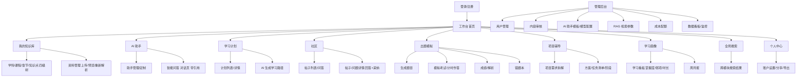

# 前端页面原型设计(通用多学科智能学习平台)

> 面向 Web + 移动端 H5 的**响应式**低保真原型与技术规范。设计围绕"学习者中心 + 学习闭环",把已确认的六大模块、学习画像、管理端组织成清晰的信息架构与页面。

---

## 一、设计理念

1. **移动优先的响应式(Mobile-first Responsive)**——单一 Vue3 代码库,按屏幕宽度自适应:PC 用「顶部导航 + 左侧菜单」,移动端用「顶部栏 + 底部 Tab」;核心操作在手机上同样可完成(全功能移动端)。
2. **学习者中心,围绕"学习闭环"组织信息**——页面顺序即用户动线:上传教材 → 建分类 → 定制助手学习 → 定计划 → 做题测评 → 看画像 → (可选)做项目。全站以「课程 / 知识点」作为贯通各模块的**内容单元**。
3. **内容单元化 + 卡片化**——"课程/章节/知识点"是可点击、可关联的卡片;点开能跳到 AI 问答、出题、社区话题、图谱。降低跳转心智负担。
4. **主行动突出(One Primary Action)**——每个页面一个主按钮(如"上传教材""开始测试""新建助手"),视觉最突出,次要操作降级为图标/文字。
5. **AI 能力内嵌但视觉降噪**——AI(问答/出题/评分/项目辅导)是核心能力,但界面保持干净:AI 以"引用标注 [1][2]、可溯源"方式呈现,不喧宾夺主;AI 生成内容有标识。
6. **状态可视化,让数据说话**——学习进度条、掌握度雷达、连续打卡、学习时长、错题数、配额余量,都做成直观可视化(图表/环形/徽章),服务"学习打卡与自我监督"。
7. **隐私与权限友好**——资源可见性(私有/公开/分享)用清晰开关与徽标;分享走"链接+密码+有效期";公开内容有审核标识。
8. **组件双端统一**——移动用 Vant,桌面用 Element Plus;图标、色彩、间距、空态/加载态/错误态统一规范。

---

## 二、信息架构(站点地图)



---

## 三、全局布局与响应式规则

- **PC(≥1024px)**:顶部导航(Logo + 全局搜索框 + 通知 + 头像) + 左侧菜单(Nav) + 主内容区。
- **移动(<1024px)**:顶部栏(Logo + 搜索 + 头像) + 底部 Tab(知识库/助手/社区/出题/我的)+ 其它入口收进"我的"。
- **统一**:右侧预留"快捷 AI"悬浮按钮(问答),方便随时提问;面包屑用于四级分类导航。
- **状态规范**:空态("暂无内容,去上传/去创建")、加载态(Skeleton)、错误态(可重试)全局统一。
- **配色**:主色科技蓝,辅色用于模块标识;知识分级用色带(学科/课程/章节/知识点)。深色模式可选。

---

## 四、核心页面原型(低保真)

### 4.1 登录 / 注册
```
┌─────────────────────────────────────────────┐
│                    [Logo]                    │
│              通用多学科智能学习平台            │
│                                               │
│  账号        [__________________]             │
│  密码        [__________________]             │
│           [        登  录        ]            │
│            没有账号?去注册                     │
│   ─────────   其他登录(占位)   ─────────       │
│  [管理员端入口]   [关于/学生体验]               │
└─────────────────────────────────────────────┘
```
> 说明:登录即进入工作台;支持记住我;注册默认角色"用户"。

### 4.2 工作台(首页)
```
┌──────┬────────────────────────────────────────────┐
│ Logo │  [全局搜索..................]  🔔  👤       │
├──────┼────────────────────────────────────────────┤
│ 工作台│  早上好,同学 👋            [继续学习>]        │
│ 我的知│  ─ 学习续航 ──────────────────────────────  │
│ 识库  │  今日进度 ▓▓▓░░                            │
│ AI助手│  连续打卡  5 天  ·  本周 3.2h  ·  掌握度 68% │
│ 学习计│  ┌──────────┐ ┌──────────┐ ┌──────────┐   │
│ 划    │  │ 我的知识库│ │ AI 助手  │ │ 出题模拟 │   │
│ 社区  │  │ 续学课程  │ │ 继续问答 │ │ 继续刷题 │   │
│ 出题  │  └──────────┘ └──────────┘ └──────────┘   │
│ 项目  │  最近学习                                │
│ 画像  │   · 高等数学 / 极限  · 数字图像处理 / 滤波  │
│ [设置]│  待办:今日 3 项 → 学习计划                 │
└──────┴────────────────────────────────────────────┘
```

### 4.3 我的知识库(资料 + 四级分类树)
```
┌────────────────────────────────────────────┐
│  ← 我的知识库          [+ 上传教材]  [分享]   │
├────────────────────────────────────────────┤
│ 分类树(四级)          │ 内容区               │
│  ▸ 计算机类            │ ┌────────────────┐  │
│    ▾ 高等数学           │ │ 高等数学.pdf   │  │
│      ▾ 第一章 极限      │ │ [已解析·12块]  │  │
│        极限定义 \[知识点]│ │ [预览][重新解析]│  │
│        连续与间断       │ ├────────────────┤  │
│      ▾ 第二章 导数      │ │ 数字图像.pdf   │  │
│  ▸ 数学类              │ │ [已解析·8块]   │  │
│  ▸ 语言类              │ └────────────────┘  │
│                        │ [私有/公开/分享]     │
└────────────────────────┴────────────────────┘
```
> 说明:分类为个人私有四级树;资料卡片显示解析状态、分块数、可见性徽标;公开需审核。

### 4.4 AI 助手(对话页)
```
┌────────────────────────────────────────────┐
│  ← 助手:高等数学答疑   [切换助手▾]  [更多]    │
├────────────────────────────────────────────┤
│  [助手头像] 绑定课程:高等数学  [摘要模式]     │
│  ▢ 你:什么是导数?                            │
│  ◇ 助手:导数是…… [1][2]                      │
│     [1] 高等数学.pdf 第12页 · 0.91           │
│     [2] 高等数学_S2 第3页 · 0.87             │
│  ▢ 你:为什么要连续?                          │
│  ◇ 助手:…… [3]                             │
├────────────────────────────────────────────┤
│  [输入框..........................] [发送]  │
│  [∅图片] [语音] [引用] [✓知识范围]          │
└────────────────────────────────────────────┘
```
> 说明:每条 AI 回答带可点击的引用来源(文档/页码/相似度),可溯源;显示助手绑定课程,即"知识隔离"。

### 4.5 助手管理 / 定制
```
┌────────────────────────────────────────────┐
│  ← 我的助手            [+ 新建助手]          │
├────────────────────────────────────────────┤
│  ┌──────────┐ ┌──────────┐ ┌──────────┐   │
│  │ 高数答疑  │ │ 考试冲刺 │ │ 论文辅导  │   │
│  │ [预设]    │ │          │ │          │   │
│  └──────────┘ └──────────┘ └──────────┘   │
│  ─ 新建/编辑配置 ─────────────────────────  │
│  名称/头像 绑定课程库[多选]                    │
│  系统提示词 [自定义文本]                       │
│  模型 [DeepSeek▾] 温度[0.7 ▓░░]              │
│  风格 [简洁/详细/教师口吻]  上下文轮数[3]       │
│  带引用 [✓]  知识范围 [整库/指定章节]          │
│        [保存]  [分享卡片]                    │
└────────────────────────────────────────────┘
```

### 4.6 学习计划
```
┌────────────────────────────────────────────┐
│  ← 学习计划          [+ 新建计划] [AI 生成]   │
├────────────────────────────────────────────┤
│  ▸ 目标:高数期末 80+  截止 6/20   [进行中]   │
│  ─ 阶段 ─────────────────────────────────  │
│  ▸ 第1阶段 极限  [80% ▓▓▓▓▓░░]  本周       │
│     6/05 极限定义   [✓ 完成]                 │
│     6/06 连续与间断 [✓ 完成]                 │
│     6/08 小测(极限)[开始>]                   │
│  ▸ 第2阶段 导数  [40% ▓▓░░░]  下周          │
│  完成知识点 → 一键触发对应小测(出题联动)     │
│  [提醒] [打卡日历 ▓▓▓░░]                     │
└────────────────────────────────────────────┘
```

### 4.7 社区(列表 + 问答详情)
```
┌────────────────────────────────────────────┐
│  ← 社区   [帖子][问答][热门][+ 发帖/提问]    │
├────────────────────────────────────────────┤
│  筛选:[课程▾][标签▾]  排序:[最新/最热]        │
│  ┌──────────────────────────────┐          │
│  │ [问] 求导法则怎么理解? [已采纳]  💬12 👍8 │
│  │  #高等数学 #导数   6/05         │          │
│  └──────────────────────────────┘          │
│  ┌──────────────────────────────┐          │
│  │ [帖] 图像增强实验报告分享      💬4  👍20  │
│  └──────────────────────────────┘          │
├────────────────────────────────────────────┤
│ 详情页:标题/正文 → 回答(可点赞/采纳) → 评论  │
│ 右侧/底部:关联课程·知识点 → 去问答/去出题     │
└────────────────────────────────────────────┘
```

### 4.8 出题模拟(生成 / 考试 / 错题本)
```
┌────────────────────────────────────────────┐
│  ← 出题模拟   [生成题目][模拟考试][错题本]     │
├────────────────────────────────────────────┤
│ 生成题目                                      │
│  出处:[教材块][用户重点][样卷]                 │
│  章节:[第一章] 题型:[单选|多选|判断|填空|简答]  │
│  题量[5] 难度[中] 附解析[✓]  [生成试题]        │
│  ─ 试卷预览 ─────────────────────────────   │
│  1. (单选) 极限的定义是? A B C D  [收起]      │
│  2. (判断) 连续必可导? [√][×]                 │
│  [开始模拟考试]                              │
├────────────────────────────────────────────┤
│ 模拟考试:限时倒计时 → 逐题作答 → 交卷 → 评分   │
│  客观题自动判分 + 主观题 AI 评分(附评语)       │
│  成绩单 + 逐题解析 → 错题自动入错题本           │
│ 错题本:错题卡(可重做/已掌握/导出)             │
└────────────────────────────────────────────┘
```

### 4.9 项目辅导
```
┌────────────────────────────────────────────┐
│  ← 项目辅导          [+ 新项目]              │
├────────────────────────────────────────────┤
│ 输入项目题目/需求 → [AI 拆解需求]             │
│  ─ 生成结果 ─────────────────────────────    │
│  需求拆解 ▶ 技术方案 ▶ 任务清单 ▶ 阶段计划    │
│  [ ] 步骤1 环境搭建   [进行中]                │
│  [ ] 步骤2 数据处理   [待开始]                │
│  [ ] 步骤3 核心算法   [待开始]                │
│  文档/报告框架 [导出]   保存项目档案[✓]        │
│  底部:该任务关联知识点 → 去问答                │
└────────────────────────────────────────────┘
```

### 4.10 学习画像
```
┌────────────────────────────────────────────┐
│  ← 学习画像                                    │
├────────────────────────────────────────────┤
│  ┌────────────┐  ┌─────────────┐            │
│  │ 掌握度雷达图 │  │ 学习时长趋势 │            │
│  └────────────┘  └─────────────┘            │
│  弱项知识点:导数、卷积(去巩固 →)              │
│  错题 12 道 · 连续打卡 5 天 · 本周 3.2h       │
│  学习报告(周/月) [生成>]   [复习建议]          │
└────────────────────────────────────────────┘
```

### 4.11 全局搜索
```
┌────────────────────────────────────────────┐
│  [搜索框................................]    │
│  分类:[资料][帖子][问答][题目]  筛课程/标签    │
│  ─ 结果 ────────────────────────────────   │
│  [资料] 高等数学.pdf 第一章 · 命中3处 >        │
│  [问答] 求导法则怎么理解? 💬12 >              │
│  [题目] 极限的定义(单选) >                   │
│  [帖]   图像增强实验报告 >                    │
└────────────────────────────────────────────┘
```

### 4.12 管理后台(管理员)
```
┌──────┬────────────────────────────────────┐
│ Logo │ [数据看板][用户][审核][AI配置][RAG]  │
├──────┼────────────────────────────────────┤
│ 用户 │ 检索/分页  ·  启用/禁用  ·  角色       │
│ 审核 │ 待审:帖子/资源/回答  [通过][驳回][理由] │
│ 配额 │ 单用户月度额度/用量  [调整][限流]      │
│ RAG  │ 分块大小/Top-K/阈值  [保存][重建向量]  │
│ 看板 │ 用户量/资料/分块/问答趋势 图表          │
└──────┴────────────────────────────────────┘
```

---

## 五、交互与状态约定

| 场景 | 约定 |
|------|------|
| 模块切换 | PC 左菜单、移动底部 Tab,均高亮当前模块;保持面包屑 |
| 上传 | 多格式拖拽/点击上传,进度条,解析状态轮询(未解析→解析中→已解析/失败+原因) |
| 引用溯源 | 回答中 [n] 可点,弹出来源卡(文档/页码/相似度) |
| 数据权限 | 资源可见性开关;分享链接生成"密码+有效期";公开内容显示"审核中/通过"徽标 |
| AI 生成 | 社区/回答标注"AI 生成"标识 |
| 空态/加载/错误 | 统一 Skeleton / 空态插画 / 重试按钮 |
| 配额 | 用量超额提示 + 降级提示(如改走较省额度模式) |
| 响应式 | ≥1024 侧栏、<1024 底部 Tab;关键操作手机可达 |
