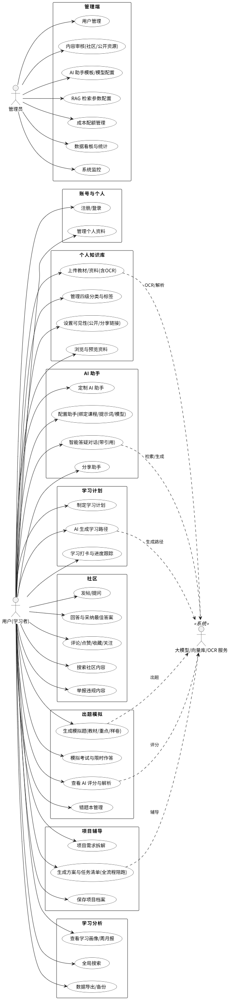
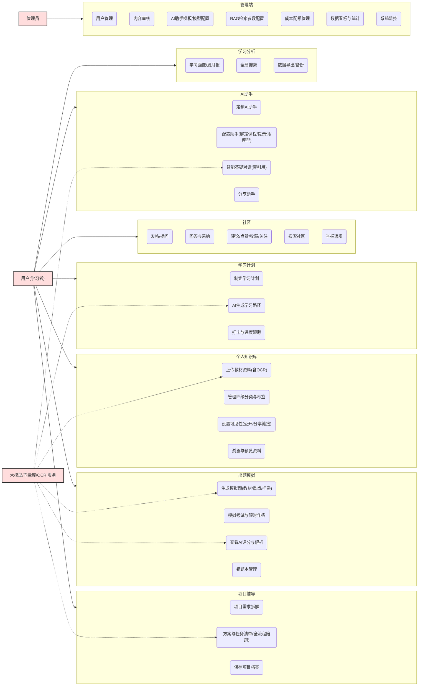
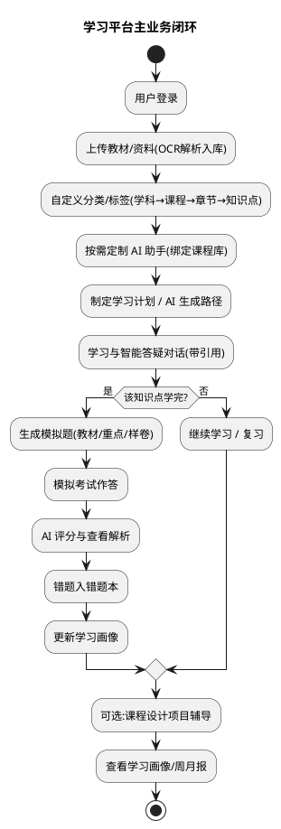
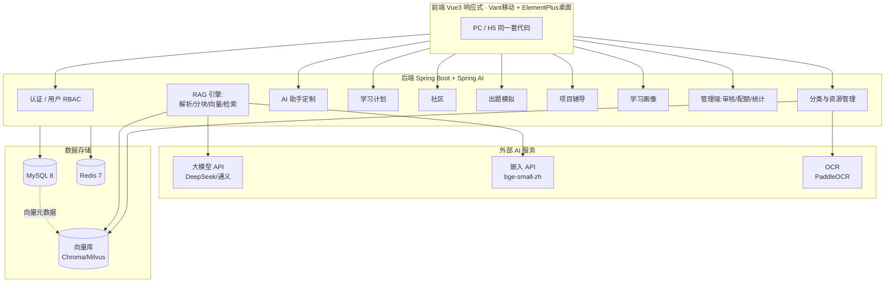
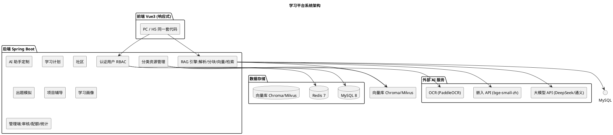

# 通用多学科智能学习平台 —— 毕业设计需求分析

> 本版为**重新设计**后的需求分析。项目定位由"数媒专业知识库问答系统"升级为**面向多学科的通用智能学习平台**。核心引擎(RAG + 大模型)不变,但只是平台的一项能力,被用户端六大模块(知识库 / AI 助手 / 学习计划 / 社区 / 出题模拟 / 项目辅导)、学习画像及管理端共同复用。

> 📌 **实现进度**:各模块已完成代码实现,见 `docs/实现进展.md`(模块清单、代码位置、论文章节映射、启动依赖、待办)。

---

## 一、需求分析

### 1.1 项目定位与系统边界

- **定位**:一个通用、多学科的自助学习平台。用户可上传自己的教材与资料、自主分类,定制 AI 助教,制定学习计划,在社区交流,做模拟题,并借助 AI 完成课程设计项目。
- **边界(毕设范围)**:
  - **Web + 移动端 H5 全功能**:响应式前端,一套代码自适应 PC 与手机。
  - **AI 全部走云端 API**(生成 + 嵌入),不做本地算力与模型微调。
  - 社区按**校内小规模**设计,不做大厂级高并发论坛。

### 1.2 用户角色

| 角色 | 职责 |
|------|------|
| **用户(学习者)** | 上传并自建知识体系、定制学习计划、定制 AI 助手、参与社区、做题、用 AI 做项目。 |
| **管理员** | 平台治理:用户管理、社区与公开资源**内容审核**、AI 助手模板/模型配置、RAG 检索参数、成本配额、数据看板。 |

> 说明:原方案中的"教师"角色**取消**。教材由用户自行上传;重点划分由用户自己标;样卷由用户上传;**出题由系统依据用户上传内容自动生成**,无需教师端。

### 1.3 功能性需求(功能需求)

#### 1.3.0 公共 AI 能力层(底座,被多模块复用)
- **RAG 引擎**:教材解析(PDF/Word/PPT/TXT)、扫描件 **OCR(PaddleOCR)**、语义分块、向量化、相似检索、引用溯源。
- **大模型服务**:多轮问答、出题、AI 评分、项目辅导、统计报告摘要等,统一走云端 API。

#### 1.3.1 个人知识库 / 资源管理
- **上传格式**:PDF / Word / PPT / TXT;扫描件走 OCR;素材中的**图片、公式(LaTeX)、代码段**特殊解析。
- **分类管理**:用户自建四级树 **学科 → 课程 → 章节 → 知识点** + 自定义标签;支持增删改、拖拽排序、打标签。
- **可见性**:私有 / 公开(管理员审核后可见) / 分享链接(可设密码、有效期)。
- **解析入库**:自动异步解析、分块、向量化;状态可监控、失败有原因;支持重新分块、重建向量索引。

#### 1.3.2 AI 助手(可定制,适配不同课程)
- **配置项**:名称/头像、绑定课程库(可多选)、系统提示词、模型(DeepSeek/通义)、温度、回答风格、上下文轮数、是否带引用、知识范围(整库或指定章节)。
- **预设模板**:内置"考试冲刺""答疑""论文/报告辅导"等,一键创建后修改。
- **知识隔离**:每个助手只在其绑定课程库内检索,切换助手即切换学习语境。
- **可分享**:助手配置生成分享卡片,他人一键套用。

#### 1.3.3 学习计划
- **结构**:目标 → 阶段 → 每日/每周任务;任务关联具体**课程、章节、知识点、教材**。
- **智能生成**:输入课程 + 截止日期 → AI 按知识点顺序生成学习路径(可手动改)。
- **跟踪**:完成打卡、进度条、连续天数、到期提醒;完成某知识点后一键触发**对应小测**闭环。

#### 1.3.4 社区
- **内容形式**:帖子/文章、**问答(提问→回答→采纳最佳答案)**、评论。
- **互动**:点赞、收藏、关注、@、引用;帖子可挂**课程/知识点**、关联教材。
- **检索与排序**:全文搜索 + 按课程/标签筛选;按最新/最热排序。
- **治理**:举报、管理员审核、敏感词过滤、**AI 生成内容标识**。

#### 1.3.5 出题模拟
- **三种出处**:
  1. **教材块**:从教材知识点自动出题;
  2. **用户重点**:用户在课件/教材上**划定的重点范围**,AI 据此出题;
  3. **样卷**:上传往年样卷,AI **按样卷风格/考点仿写全新题目**(不剧透旧题)。
- **题型**:单选 / 多选 / 判断 / 填空 / 简答;**题量、难度、章节范围、是否附解析**可调。
- **模拟考试**:限时、交卷、**客观题自动判分 + 主观题 AI 评分(附评语)**、逐题解析、成绩单。
- **错题本**:自动收录错题,可重做、可导出。

#### 1.3.6 课程设计项目辅导
- 输入项目题目/需求 → AI **拆解需求、生成技术方案、任务清单与阶段计划**。
- **全流程陪跑**:需求理解 → 方案设计 → 编码建议 → 文档/报告框架。
- 产出(项目文档、大纲)**沉淀为项目档案**,并入学习画像。

#### 1.3.7 学习画像(个人统计)
- **个人看板**:学习时长、掌握度雷达图、弱项知识点分析、错题本统计、连续打卡日历。
- **学习报告**:AI 生成的周报 / 月报摘要。
- **数据来源**:问答、做题、打卡、浏览、项目档案。

#### 1.3.8 管理端(管理员)
- 用户管理;
- 社区与公开资源**内容审核**;
- AI 助手模板 / 模型配置;
- RAG 检索参数(相似度阈值、Top-K、分块大小);
- **成本配额**管理(单用户月度额度、限流);
- 数据看板与统计;
- **系统监控与运维**(运行状态、接口调用、并发与告警)。

#### 1.3.9 补充功能(必要项)
- **平台级全局搜索**:一个入口同时搜资料 / 帖子 / 问答 / 题目。
- **AI 内容合规**:社区帖子与 AI 回答标注"AI 生成";敏感词 / 违规内容过滤。
- **成本与配额**:管理端设单用户额度 / 限流,防滥用。
- **大模型调用健壮性**:重试、超时、失败降级、Redis 缓存热点问答。
- **分享与权限细化**:分享链接支持密码 / 有效期,可分享给**指定人**;审核流。
- **数据隐私与备份**:敏感字段加密、数据导出备份。
- **移动端多端一致性**:响应式 H5、大文件上传进度、分页/懒加载、弱网提示。

### 1.4 非功能性需求

| 维度 | 要求 |
|------|------|
| 性能 | 问答/检索秒级响应;上传解析**异步**不阻塞;校内并发(几十~几百用户)。 |
| 安全 | JWT 认证 + RBAC(用户/管理员);接口鉴权;内容审核 + 敏感词;敏感字段加密;上传文件类型校验。 |
| 可用性 | 界面友好、移动端适配;空态/加载态/错误提示完整。 |
| 可维护性 | 前后端分离、模块化、统一日志与异常处理、参数校验。 |
| 兼容性 | 主流浏览器 + 手机 WebView;PDF/Word/PPT/TXT/扫描件 OCR 兼容。 |
| 可扩展性 | 预留多模态(图片/视频/语音)、召回重排序(BGE-Reranker)等(论文展望)。 |

### 1.5 可行性分析

- **技术可行性**:Spring AI + RAG 成熟;Element Plus + Vant 组件库成熟;OCR 选 PaddleOCR 可就地部署;各功能模块均有成熟技术支撑,本科毕设难度可控。
- **经济可行性**:AI 走云端 API 按量计费;校内规模 + 月度额度配额可控制成本。
- **操作可行性**:用户"上传即用",无学习门槛。

### 1.6 用例图

系统参与者:**用户(学习者)**、**管理员**;支撑系统(次要参与者):**大模型 API / 向量库 / OCR 服务**。

> 🖼 **图 3-1 系统用例图** —— 请把 `docs/screenshots/用例图.png`(由 `docs/用例图.puml` 导出)放到下一行位置:



#### 1.6.1 用例图(PlantUML)

可粘贴到 PlantUML 服务/VS Code/IDEA 插件渲染:

```plantuml
@startuml
left to right direction
skinparam packageStyle rectangle
skinparam usecase {
  BackgroundColor White
  BorderColor Black
}

actor "用户(学习者)" as U
actor "管理员" as A
actor "大模型/向量库/OCR 服务" as AI <<系统>>

package "账号与个人" {
  usecase "注册/登录" as UC1
  usecase "管理个人资料" as UC2
}

package "个人知识库" {
  usecase "上传教材/资料(含OCR)" as UC3
  usecase "管理四级分类与标签" as UC4
  usecase "设置可见性(公开/分享链接)" as UC5
  usecase "浏览与预览资料" as UC6
}

package "AI 助手" {
  usecase "定制 AI 助手" as UC7
  usecase "配置助手(绑定课程/提示词/模型)" as UC8
  usecase "智能答疑对话(带引用)" as UC9
  usecase "分享助手" as UC10
}

package "学习计划" {
  usecase "制定学习计划" as UC11
  usecase "AI 生成学习路径" as UC12
  usecase "学习打卡与进度跟踪" as UC13
}

package "社区" {
  usecase "发帖/提问" as UC14
  usecase "回答与采纳最佳答案" as UC15
  usecase "评论/点赞/收藏/关注" as UC16
  usecase "搜索社区内容" as UC17
  usecase "举报违规内容" as UC18
}

package "出题模拟" {
  usecase "生成模拟题(教材/重点/样卷)" as UC19
  usecase "模拟考试与限时作答" as UC20
  usecase "查看 AI 评分与解析" as UC21
  usecase "错题本管理" as UC22
}

package "项目辅导" {
  usecase "项目需求拆解" as UC23
  usecase "生成方案与任务清单(全流程陪跑)" as UC24
  usecase "保存项目档案" as UC25
}

package "学习分析" {
  usecase "查看学习画像/周月报" as UC26
  usecase "全局搜索" as UC27
  usecase "数据导出/备份" as UC28
}

U --> UC1
U --> UC2
U --> UC3
U --> UC4
U --> UC5
U --> UC6
U --> UC7
U --> UC8
U --> UC9
U --> UC10
U --> UC11
U --> UC12
U --> UC13
U --> UC14
U --> UC15
U --> UC16
U --> UC17
U --> UC18
U --> UC19
U --> UC20
U --> UC21
U --> UC22
U --> UC23
U --> UC24
U --> UC25
U --> UC26
U --> UC27
U --> UC28

A --> UC29
A --> UC30
A --> UC31
A --> UC32
A --> UC33
A --> UC34
A --> UC35

package "管理端" {
  usecase "用户管理" as UC29
  usecase "内容审核(社区/公开资源)" as UC30
  usecase "AI 助手模板/模型配置" as UC31
  usecase "RAG 检索参数配置" as UC32
  usecase "成本配额管理" as UC33
  usecase "数据看板与统计" as UC34
  usecase "系统监控" as UC35
}

' 支撑系统接入:AI 类用例依赖外部服务
UC9 ..> AI : 检索/生成
UC12 ..> AI : 生成路径
UC19 ..> AI : 出题
UC21 ..> AI : 评分
UC24 ..> AI : 辅导
UC3 ..> AI : OCR/解析
@enduml
```

> 📄 该图源文件已存为 `docs/用例图.puml`;渲染方式见文末"渲染提示"。无 Graphviz 时可在 `@startuml` 后加 `!pragma layout smetana` 用内置引擎渲染。

#### 1.6.2 用例图(Mermaid 备选)

Mermaid 无原生用例图语法,用流程图近似;若所用 Markdown 渲染器支持 Mermaid 可直接显示:



#### 1.6.3 用例汇总表

| 编号 | 用例 | 参与者 | 简述 |
|------|------|--------|------|
| UC1 | 注册/登录 | 用户 | 注册、JWT 登录 |
| UC2 | 管理个人资料 | 用户 | 修改昵称/头像等 |
| UC3 | 上传教材/资料 | 用户 | 多格式上传,扫描件走 OCR(核心) |
| UC4 | 管理分类与标签 | 用户 | 四级树(学科→课程→章节→知识点)+ 标签 |
| UC5 | 设置可见性 | 用户 | 私有/公开(审核)/分享链接 |
| UC6 | 浏览与预览资料 | 用户 | 文档预览,知识点目录树 |
| UC7 | 定制 AI 助手 | 用户 | 新建多助手适配不同课程(核心) |
| UC8 | 配置助手 | 用户 | 绑定课程库/提示词/模型/温度等 |
| UC9 | 智能答疑对话 | 用户 | 多轮问答 + 引用溯源(核心) |
| UC10 | 分享助手 | 用户 | 生成分享卡片供他人套用 |
| UC11 | 制定学习计划 | 用户 | 目标→阶段→任务 |
| UC12 | AI 生成学习路径 | 用户 | 课程+截止日期→自动排程 |
| UC13 | 打卡与进度跟踪 | 用户 | 完成度、连续天数、提醒 |
| UC14 | 发帖/提问 | 用户 | 发帖、发布问答 |
| UC15 | 回答与采纳 | 用户 | 回答他人并采纳最佳答案 |
| UC16 | 评论/点赞/收藏/关注 | 用户 | 社区互动 |
| UC17 | 搜索社区内容 | 用户 | 社区内搜索 |
| UC18 | 举报违规内容 | 用户 | 举报触发审核 |
| UC19 | 生成模拟题 | 用户 | 教材/重点/样卷三来源出题(核心) |
| UC20 | 模拟考试与限时作答 | 用户 | 限时交卷 |
| UC21 | 查看 AI 评分与解析 | 用户 | 客观自动判分 + 主观 AI 评分(核心) |
| UC22 | 错题本管理 | 用户 | 错题重做/导出 |
| UC23 | 项目需求拆解 | 用户 | AI 拆解题目需求(核心) |
| UC24 | 方案与任务清单 | 用户 | 生成方案、阶段计划 |
| UC25 | 保存项目档案 | 用户 | 项目产出沉淀 |
| UC26 | 学习画像/周月报 | 用户 | 掌握度/弱项/时长/连续打卡 |
| UC27 | 全局搜索 | 用户 | 跨资料/帖子/问答/题目 |
| UC28 | 数据导出/备份 | 用户 | 个人数据导出 |
| UC29 | 用户管理 | 管理员 | 增删改查、角色 |
| UC30 | 内容审核 | 管理员 | 社区与公开资源审核 |
| UC31 | AI 助手模板/模型配置 | 管理员 | 助手模板与可选模型 |
| UC32 | RAG 检索参数配置 | 管理员 | 阈值、Top-K、分块大小 |
| UC33 | 成本配额管理 | 管理员 | 单用户月度额度/限流 |
| UC34 | 数据看板与统计 | 管理员 | 全平台统计 |
| UC35 | 系统监控 | 管理员 | 运行/并发/告警 |

#### 1.6.4 核心用例规约(表格化)

**用例 1:UC3 上传教材/资料(含 OCR)**

| 项 | 内容 |
|----|------|
| 用例名称 | 上传教材/资料(含 OCR) |
| 参与者 | 用户(学习者) |
| 前置条件 | 已登录,处于"个人知识库"页 |
| 主事件流 | ① 选择文件(PDF/Word/PPT/TXT)→ ② 类型与大小校验 → ③ 上传存储 → ④ 异步解析(文本型直接抽取;扫描件走 OCR)→ ⑤ 语义分块 → ⑥ 向量化 → ⑦ 写向量库与元数据 → ⑧ 更新解析状态 |
| 备选/异常流 | ②a 类型/大小非法 → 提示并终止;④a 解析失败 → 置"解析失败"并记原因,可重试/删除;④b OCR 识别率低 → 提示可人工调整分块 |
| 后置条件 | 资料可浏览、可检索、可出题;解析状态已更新 |
| 业务规则 | 仅本人管理自己的资料;设为公开需管理员审核;支持重新分块与重建索引 |

**用例 2:UC7/UC8 定制并配置 AI 助手**

| 项 | 内容 |
|----|------|
| 用例名称 | 定制并配置 AI 助手 |
| 参与者 | 用户(学习者) |
| 前置条件 | 已登录,存在至少一门课程/教材 |
| 主事件流 | ① 新建助手 → ② 绑定课程库(可多选)→ ③ 设置系统提示词、模型、温度、回答风格、上下文轮数、知识范围 → ④ 保存 |
| 备选/异常流 | ③a 绑定课程为空 → 提示不可保存;④a 模型不可用 → 降级到默认模型 |
| 后置条件 | 助手可用;切换助手即切换学习语境;配置可生成分享卡片 |
| 业务规则 | 助手只在绑定课程库内检索(知识隔离);模板可一键套用再改 |

**用例 3:UC9 智能答疑对话(带引用)**

| 项 | 内容 |
|----|------|
| 用例名称 | 智能答疑对话(带引用) |
| 参与者 | 用户(学习者) |
| 前置条件 | 已登录,选定一个绑定课程库的助手 |
| 主事件流 | ① 用户提问 → ② 在绑定课程库中相似度检索 Top-K → ③ 拼接多轮上下文与知识块 → ④ 大模型生成回答 → ⑤ 返回并标注 [1][2] 引用来源(文档名+页码+相似度)→ ⑥ 落库 `qa_record` |
| 备选/异常流 | ②a 召回为空 → 提示"知识库暂无相关内容";⑤a 大模型调用失败 → 重试/降级,返回缓存或提示 |
| 后置条件 | 回答引用可溯源;问答历史入库 |
| 业务规则 | 回答须带引用;支持追问与多轮上下文;受配额限流约束 |

**用例 4:UC19 生成模拟题(教材/重点/样卷)**

| 项 | 内容 |
|----|------|
| 用例名称 | 生成模拟题(教材/重点/样卷) |
| 参与者 | 用户(学习者) |
| 前置条件 | 已上传教材 / 已划重点 / 已上传样卷之一 |
| 主事件流 | ① 选择出处(教材块/用户重点/样卷)→ ② 设定题型、题量、难度、章节范围、是否附解析 → ③ 系统自动出题 → ④ (样卷)按样卷风格/考点仿写新题 → ⑤ 生成并保存试卷 |
| 备选/异常流 | ③a 出处内容不足 → 提示"内容过少无法生成";③b 生成结果质量低 → 可重新生成/调整参数 |
| 后置条件 | 试卷可保存,可发起模拟考试 |
| 业务规则 | 题目由系统依据上传内容自动生成,无需人工出题;支持单选/多选/判断/填空/简答 |

**用例 5:UC21 查看 AI 评分与解析**

| 项 | 内容 |
|----|------|
| 用例名称 | 查看 AI 评分与解析 |
| 参与者 | 用户(学习者) |
| 前置条件 | 已完成一次模拟考试并交卷 |
| 主事件流 | ① 客观题自动判分 → ② 主观题/大题送 AI 评分并附评语 → ③ 汇总成绩单 → ④ 逐题解析 → ⑤ 错题自动入错题本 |
| 备选/异常流 | ②a AI 评分失败 → 降级为"参考答案比对",标注待人工复核 |
| 后置条件 | 分数、解析、错题入库;学习画像更新 |
| 业务规则 | 客观题绝对判分;主观题给出分值与评语;错题可重做/导出 |

**用例 6:UC24 项目辅导(全流程陪跑)**

| 项 | 内容 |
|----|------|
| 用例名称 | 项目辅导(全流程陪跑) |
| 参与者 | 用户(学习者) |
| 前置条件 | 已登录 |
| 主事件流 | ① 输入项目题目/需求 → ② AI 拆解需求 → ③ 生成技术方案 → ④ 输出任务清单与阶段计划 → ⑤ 分阶段指导(可结合相关知识点检索)→ ⑥ 形成文档/报告框架 |
| 备选/异常流 | ②a 需求描述不清晰 → 提示补充/引导式追问 |
| 后置条件 | 项目档案入库,并入学习画像 |
| 业务规则 | 全程留痕,形成可复用的项目档案 |

---

### 1.7 主要业务流程图

#### 1.7.1 学习平台主业务闭环(PlantUML)



#### 1.7.2 主业务闭环(流程图,Markdown 渲染友好)

```mermaid
flowchart TD
  A[用户登录] --> B[上传教材/资料<br>OCR 解析入库]
  B --> C[自定义分类/标签]
  C --> D[定制 AI 助手<br>绑定课程库]
  D --> E[制定学习计划 / AI 生成路径]
  E --> F[学习与智能答疑对话]
  F --> G{知识点学完?}
  G -- 是 --> H[生成模拟题<br>教材/重点/样卷]
  H --> I[模拟考试作答]
  I --> J[AI 评分与查看解析]
  J --> K[错题入错题本]
  K --> L[更新学习画像]
  G -- 否 --> M[继续学习/复习]
  M --> F
  L --> N[项目辅导(可选)]
  N --> O[查看学习画像/周月报]
  O --> P{继续?}
  P -- 是 --> F
  P -- 否 --> Q[结束]
```

> 说明:该闭环把"知识库 → AI 助手 → 学习计划 → 出题测评 → 画像 → 项目辅导"串起来,体现平台"学-练-测-交流-做项目"一体化。

---

## 二、技术选型(推荐方案)

| 层级 | 选型 | 说明 |
|------|------|------|
| 后端框架 | Spring Boot 3.x | 企业级主流框架,生态完善,求职加分 |
| AI 编排 | Spring AI | 官方 AI 组件,原生集成大模型与向量库 |
| 数据库 | MySQL 8.0 | 用户、内容、计划、社区、题目等业务数据 |
| 向量数据库 | Chroma / Milvus | Chroma 轻量易部署,Milvus 生产级 |
| 缓存 | Redis 7 | 对话上下文、热点问答、配额计数、图谱缓存 |
| 文档解析 | Apache PDFBox + POI + PaddleOCR + LaTeX/代码段处理 | 多格式与扫描件 |
| 生成大模型 | DeepSeek / 通义千问 | 云端 API,免本地算力 |
| 嵌入模型 | bge-small-zh / text-embedding | 中文效果好,可本地/云端 |
| 前端 | Vue3 + Vite + Vant(移动)+ Element Plus(桌面) | 响应式,一套代码自适应 PC/手机 |
| 可视化 | ECharts | 知识图谱、学习画像、统计图表 |

---

## 三、RAG 核心业务流程

1. **文档摄入与解析**:解析 PDF/Word/PPT/TXT,扫描件走 OCR,保留页码/标题层级。
2. **文本分块**:递归字符分割,按语义块拆分(默认 500 字符 / 重叠 50),避免知识点被切断。
3. **向量嵌入**:调用嵌入模型,将文本块转为向量,存原文 + 元数据(文档名、页码、章节、所属课程)。
4. **向量入库**:写入向量库,建立索引支持相似度检索,分块 ID 与库表一一对应。
5. **用户提问检索**:问题向量化 → 相似度检索 Top-K(阈值后台可调)。
6. **召回重排**:可选 BGE-Reranker 二次排序,提升精准度。
7. **大模型生成回答**:知识块 + 用户问题 + 提示词 → 生成基于知识库的精准回答并附引用来源。

> RAG 不仅用于问答,也支撑**出题**(从教材块/重点/样卷生成)、**项目辅导**(从项目需求 + 相关知识点检索)等场景。

---

## 四、系统总体设计(数据库设计)

### 4.1 系统架构(分层)

整体分四层:**前端(响应式) → 后端(Spring Boot 业务 + RAG 引擎) → 外部 AI 服务(大模型/嵌入/OCR) + 存储(MySQL/Redis/向量库)**。

#### 4.1.1 架构图(Mermaid)



> 说明:请求先由 Web 层(前端)转发到业务接口,业务层按需调用 RAG 引擎(解析/检索)与外部 AI 服务;数据分三类存储——MySQL(业务)、Redis(缓存/配额/上下文)、向量库(语义检索)。移动端与 PC 共用同一套响应式前端。

#### 4.1.2 架构图(PlantUML,可导出)



### 4.2 数据库概念模型(ER)

数据库共 **32 张表**,覆盖九大模块(账号/分类、资料知识库、AI 助手、学习计划、社区、出题模拟、项目辅导、学习画像、治理与配额)。以下为核心关系 ER 概念图:

#### 4.2.1 ER 图(Mermaid)

```mermaid
erDiagram
  sys_user ||--o{ resource : 上传
  sys_user ||--o{ assistant : 定制
  sys_user ||--o{ study_plan : 制定
  sys_user ||--o{ post : 发布
  sys_user ||--o{ question : 生成题目
  sys_user ||--o{ project_case : 立项
  sys_user ||--o{ review_record : 举报
  sys_user ||--o{ quota_log : 消耗配额

  subject ||--o{ course : 包含
  course ||--o{ chapter : 包含
  chapter ||--o{ knowledge_point : 包含
  subject ||--o{ resource : 归属学科
  course ||--o{ resource : 归属课程
  course ||--o{ assistant : 绑定(知识隔离)

  resource ||--o{ doc_chunk : 分块
  resource ||--o{ user_keypoint : 划定重点
  resource }o--o{ tag : 打标签

  assistant ||--o{ qa_record : 产生
  assistant ||--o{ assistant_course : 绑定课程

  study_plan ||--o{ plan_task : 包含
  plan_task }o--o{ course : 关联
  plan_task }o--o{ knowledge_point : 关联

  post ||--o{ answer : 获取回答
  post ||--o{ comment : 评论
  post }o--o{ course : 关联
  post ||--o{ post_like : 点赞

  question ||--o{ paper_question : 被选入
  paper ||--o{ paper_question : 包含
  paper ||--o{ exam_record : 产生考试
  exam_record ||--o{ exam_answer : 包含
  question ||--o{ mistake : 形成错题
```

#### 4.2.2 ER 图(PlantUML,可导出)

```plantuml
@startuml
title 学习平台核心 ER 概念图
hide circle
skinparam linetype ortho

entity sys_user { user_id (PK) }
entity subject { subject_id (PK) }
entity course { course_id (PK) }
entity chapter { chapter_id (PK) }
entity knowledge_point { kp_id (PK) }
entity resource { resource_id (PK) }
entity doc_chunk { chunk_id (PK) }
entity assistant { assistant_id (PK) }
entity study_plan { plan_id (PK) }
entity plan_task { task_id (PK) }
entity post { post_id (PK) }
entity answer { answer_id (PK) }
entity paper { paper_id (PK) }
entity question { question_id (PK) }
entity exam_record { exam_id (PK) }
entity exam_answer { exam_answer_id (PK) }
entity mistake { mistake_id (PK) }
entity project_case { project_id (PK) }
entity quota_log { quota_id (PK) }
entity review_record { review_id (PK) }

sys_user ||--o{ resource
sys_user ||--o{ assistant
sys_user ||--o{ study_plan
sys_user ||--o{ post
sys_user ||--o{ question
subject ||--o{ course
course ||--o{ chapter
chapter ||--o{ knowledge_point
course ||--o{ resource
course ||--o{ assistant
resource ||--o{ doc_chunk
assistant ||--o{ qa_record
study_plan ||--o{ plan_task
post ||--o{ answer
paper ||--o{ question
paper ||--o{ exam_record
exam_record ||--o{ exam_answer
question ||--o{ mistake
sys_user ||--o{ project_case
sys_user ||--o{ quota_log
sys_user ||--o{ review_record
@enduml
```

### 4.3 数据库表设计(表清单)

建表 DDL 已写入 `sql/init_learning.sql`(独立新库 `learn_platform`,与旧库 `rag_edu` 互不影响;32 张表,MySQL 8/utf8mb4)。按模块分组如下:

| 模块 | 表 |
|------|-----|
| 账号/分类 | `sys_user`、`subject`、`course`、`chapter`、`knowledge_point`、`tag` |
| 资料知识库 | `resource`、`resource_tag`、`doc_chunk`、`user_keypoint` |
| AI 助手 | `assistant`、`assistant_course`、`qa_record` |
| 学习计划 | `study_plan`、`plan_task` |
| 社区 | `post`、`answer`、`comment`、`post_like`、`follow` |
| 出题模拟 | `question`、`paper`、`paper_question`、`exam_record`、`exam_answer`、`mistake` |
| 项目辅导 | `project_case` |
| 学习画像 | `study_log`、`checkin` |
| 治理/权限/配额 | `review_record`、`share_link`、`quota_log` |

> 说明:旧版 5 表(`sys_user/course/course_document/doc_chunk/qa_record`)可平滑迁移到新库:对应关系为 `course_document→resource(+可见性/审核)`,`course→course(+归属用户/学科)`,`doc_chunk` 保留,`qa_record` 增加 `assistant_id` 外键。

---

## 五、毕业论文完整大纲(适配后)

1. **绪论** —— 研究背景与意义、国内外研究现状(大模型/RAG/智能学习平台)、研究内容与论文结构。
2. **相关技术基础** —— RAG 原理、向量库与嵌入模型、Spring Boot + Spring AI、Vue3 + Vant/Element Plus、OCR。
3. **系统需求分析** —— 可行性分析、功能性需求(用例图)、非功能性需求(本节内容)。
4. **系统总体设计** —— 系统架构、功能模块划分、数据库设计、RAG 核心流程。
5. **系统详细实现** —— 开发环境、文档解析与 OCR、向量检索、AI 助手、出题与评分、社区、学习计划、项目辅导、前端实现。
6. **系统测试** —— 测试环境、功能测试、性能测试、问答与出题效果评估。
7. **总结与展望** —— 工作总结、不足(如多模态、重排序、扫描件识别率)、展望。

---

## 六、开发时间规划(按 12 周毕设周期)

1. **第 1-2 周**:需求分析、文献查阅、开题报告。
2. **第 3 周**:环境搭建、数据库设计、项目骨架。
3. **第 4-5 周**:后端基础(认证、用户、四级分类、资料上传解析、OCR)。
4. **第 6-7 周**:RAG 核心(解析分块、向量入库、检索问答)+ AI 助手定制。
5. **第 8 周**:出题模拟(教材/重点/样卷)、AI 评分与错题本。
6. **第 9 周**:学习计划、社区、项目辅导、学习画像。
7. **第 10 周**:全局搜索、内容审核、配额、响应式移动端联调。
8. **第 11-12 周**:系统测试、bug 修复、论文撰写、答辩准备。

---

## 七、加分亮点与答辩建议

### 1. 加分亮点
- **平台完整性**:从单点问答升级为"学-练-测-交流-做项目"一体化的学习平台,架构层次清晰。
- **工程完整性**:前后端分离、JWT + RBAC 权限、日志、审核、配额,符合企业规范。
- **AI 能力**:**AI 助手可定制**、**多源自动出题 + AI 评分**、**项目全流程陪跑**,是区别于通用问答的亮点。
- **可视化**:知识图谱、学习画像(掌握度/弱项/时长)、统计看板,答辩演示效果好。
- **多端适配**:响应式移动端,体现用户体验完整度。
- **可扩展性**:预留多模态、重排序、语音等接口。

### 2. 答辩演示建议
- 提前导入 2-3 门**不同学科**的教材(如数学、计算机、语言类),演示通用性。
- 演示一个题库:用教材/自划重点/上传样卷三种方式生成题目,并展示 AI 评分。
- 演示"定制助手切换课程"的效果,对比通用大模型与本系统的**带引用精准回答**。
- 展示后台审核、配额、向量库管理与数据看板。

---

## 八、避坑提醒

1. **不要微调大模型**:本科毕设无需模型训练,聚焦 RAG 工程与系统集成。
2. **AI 走 API**:生成与嵌入都调云端 API,节省算力与时间;嵌入可本地轻量。
3. **控制范围**:移动端选"全功能"会加倍工作量,务必用响应式一套代码实现,避免双套前端。
4. **出题质量别贪多**:先保证简单题型(选择/判断/填空)出题稳定,再上主观题 AI 评分。
5. **OCR 作为亮点而非主线**:扫描件识别率是难点,可列为"不足与展望",主线仍为精确率较高的文本型教材。
6. **配额与成本**:提前设好单用户额度,避免演示时 API 成本失控。
7. **数据就近取材**:用自己常见课程的教材 PDF 即可,不必额外找大量数据。
